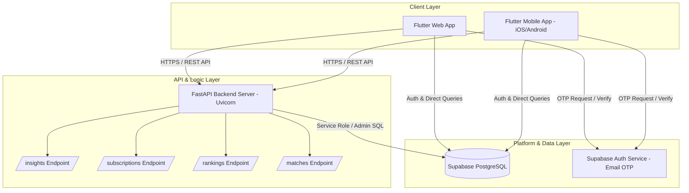
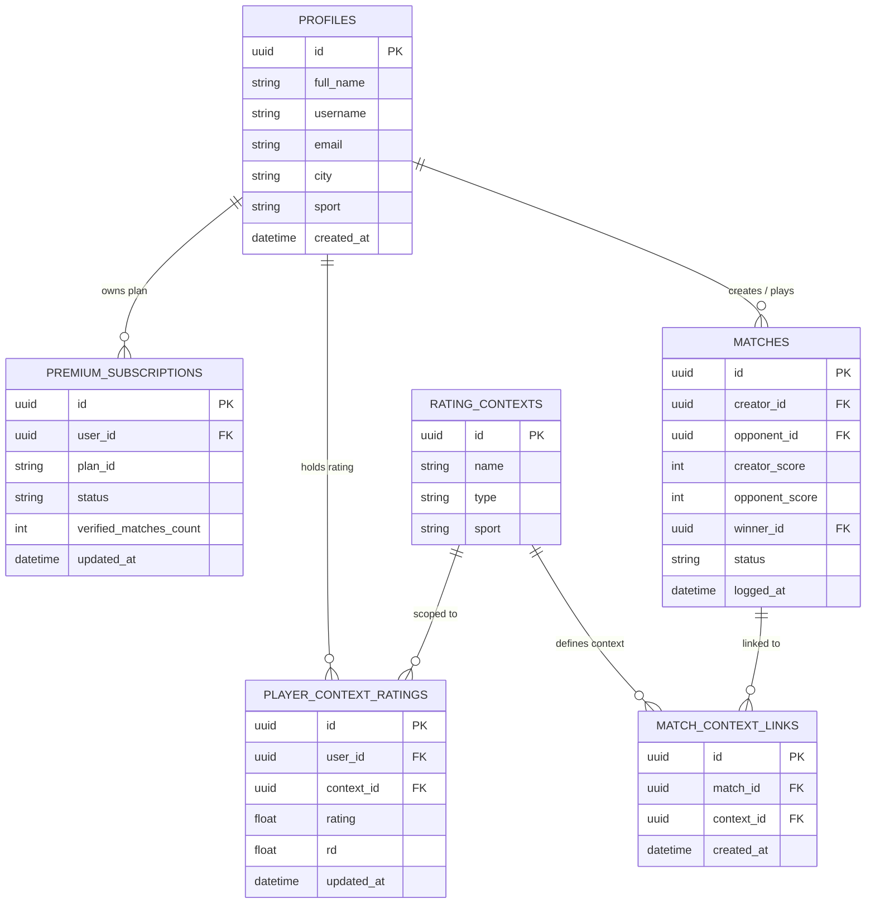
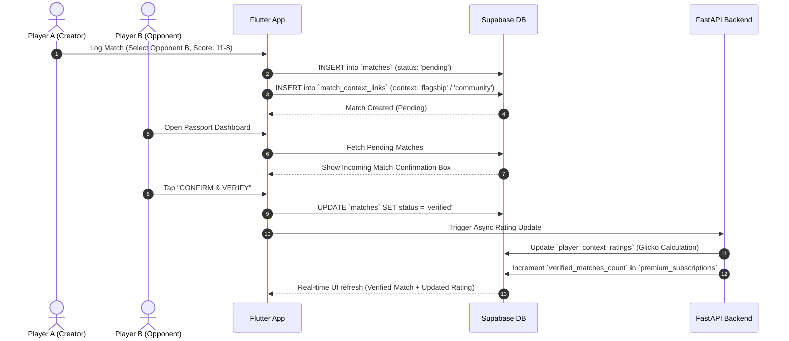

# ⚡ Zorva System Architecture & High-Level Design

## 1. Executive Overview

**Zorva** is a real-time competitive sports passport and multi-context rating platform. It enables players across cities to log match results, verify scores peer-to-peer, track dynamic Glicko/Elo ratings across multiple game contexts (**Official/Flagship** vs. **Community**), and maintain an official digital sports passport.

---

## 2. High-Level Architecture Diagram

---

## 3. Core Component Architecture

### A. Frontend Application (`apps/mobile_flutter`)
- **Framework**: Flutter (Dart) targeting Web, iOS, and Android.
- **Design System**: `ZorvaTheme` dark mode aesthetic with glassmorphism gradients and gold visual accents.
- **Key Modules**:
  - **Onboarding Flow**: Single-button entrance (`WelcomeScreen`), dynamic unified email OTP sign-in (`SignInScreen`), and first-time city selection (`CityOnboardingScreen`).
  - **Passport Dashboard (`HomeDashboardScreen`)**:
    - Interactive Header with Clickable User Profile Pill.
    - Verified & Pending Match Lists with sleek height scoping and visual type tags (🏆 **OFFICIAL ⚡** vs. 👥 **COMMUNITY 🎾**).
    - Quick Match Logging modal trigger.
  - **Leaderboards & Insights (`LeaderboardsScreen`)**: City & global rankings by rating context.
  - **Profile (`ProfileScreen`)**: Player statistics, city preferences, and sign-out control with back navigation.

---

### B. Backend REST API (`backend/app`)
- **Framework**: FastAPI (Python 3.11+) hosted via Uvicorn.
- **Key Routes**:
  - `/insights/{user_id}`: Single server-side roundtrip calculating win streaks, form guide, rivalries, and tier-specific context ratings.
  - `/subscriptions/{user_id}`: Tracks subscription tier (`founder_flagship`, `community_trial`) and verified match quotas.
  - `/rankings/{city}`: Evaluates city leaderboard order and percentile positioning.

---

### C. Backend Database & Auth Layer (Supabase)
- **Engine**: PostgreSQL with Row-Level Security (RLS).
- **Authentication**: Passwordless Email OTP with multi-OtpType fallback (`email`, `signup`, `magiclink`) for seamless auto-provisioning.

---

## 4. Database Entity-Relationship Diagram (ERD)

---

## 5. End-to-End Data Flows

### Match Logging & Peer Verification Flow

---

## 6. Key Design Highlights

1. **Multi-Context Rating Engine**: Separates official tournament/flagship matches from casual community matches so player competitive ratings remain authoritative.
2. **Unified Authentication Experience**: Auto-provisions new users seamlessly while routing existing players directly to their Passport without password complexity.
3. **Performant Layout Architecture**: Scoped 3-match height containers with smooth physics to avoid UI overlap with floating action controls across screen sizes.
