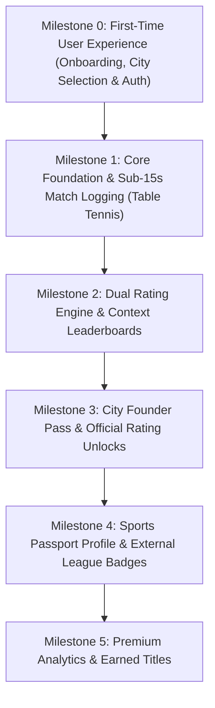

# Zorva — Technical Co-Founder Strategy & Master Implementation Plan

Welcome to the **Zorva** Master Architecture & Development Roadmap.

---

## 1. Co-Founder Technical Strategy

### A. Vision & Position ("LinkedIn for Sports Identity")
* **Core Concept**: Zorva is the unified sports passport where every confirmed game contributes to a player's lifelong identity.
* **Non-Replacement Strategy**: Zorva does not attempt to replace existing rating bodies (USATT, State Associations, Corporate Leagues). Instead, it aggregates and displays them side-by-side with Community and Official Zorva ratings.

### B. Rating Model & Monetization Rules
1. **Community Rating (100% Free Always)**:
   * Free for every registered player to track every game.
   * Dual confirmation required for every match.
2. **Official Zorva Rating (Competitive Tier)**:
   * Powers Official Rankings, City Leaderboards, and Earned Titles.
   * **City Founder Incentive**: First 20 players in every city receive lifetime Official Rating + Founding Player Badge.
   * **Post-Launch**: One-time Official Rating Pass purchase.
3. **Monetization Ethics**:
   * *Payments NEVER buy rankings or titles.*
   * Premium provides analytics, rating history graphs, match insights, and title showcasing.

---

## 2. Tech Stack: Flutter + Supabase Direct

* **Frontend**: Flutter Clean Architecture (`apps/mobile_flutter`) targeting iOS, Android, and Web with 60fps native performance.
* **Backend & DB**: Supabase (PostgreSQL 15+, Supabase Auth, Row Level Security, Realtime WebSockets).
* **Cloud Infrastructure Cost**: $0/month for MVP stage.

---

## 3. Master Milestone Roadmap

---

## 4. Milestone Specifications

### Milestone 0: First-Time User Experience (Onboarding & Auth) (CURRENT FOCUS 🎯)
* **Goal**: Build the first screen a brand-new user sees when opening Zorva for the first time.
* **User Stories**:
  1. *As a new player*, I want to see a sleek welcome screen with Zorva's brand tagline ("A new way to play. Make every game count. Build your sports identity.") and core value propositions.
  2. *As a new player*, I want to sign up or sign in easily via Supabase Auth (Email & Password / Magic Link).
  3. *As a new player*, I want to pick my city (e.g. Austin, New York, San Francisco) and claim a **Founding Player Badge** if I am among the first 100 players in my city.
  4. *As a new player*, I want to choose my handle (`@username`) and display name before entering my personal sports passport.
* **UI Screens**:
  * `welcome_carousel_screen.dart` — Animated brand slides & tagline.
  * `auth_screen.dart` — Sign In / Sign Up form with Supabase Auth.
  * `onboarding_city_screen.dart` — City selection & Founding Player badge claim modal.
* **Database & Logic**:
  * Supabase Auth integration (`supabase.auth.signUp()`, `supabase.auth.signInWithPassword()`).
  * `city_player_count` helper to track city founding player eligibility (< 100 players).

---

### Milestone 1: Core Foundation & Sub-15s Match Logging (Completed ✅)
- [x] Flutter Clean Architecture project (`apps/mobile_flutter`).
- [x] Pure Dart Glicko-2 engine implementation ([glicko2.dart](file:///c:/zorva/apps/mobile_flutter/lib/features/rating/domain/glicko2.dart)) verified with 100% unit test pass.
- [x] Supabase Direct connection & RLS migration ([0003_enable_public_rls.sql](file:///c:/zorva/supabase/migrations/0003_enable_public_rls.sql)).
- [x] Sub-15-second 3-tap match logger ([add_match_screen.dart](file:///c:/zorva/apps/mobile_flutter/lib/features/match_logger/presentation/screens/add_match_screen.dart)).
- [x] 1-tap in-app approval banner on Home Dashboard ([home_dashboard_screen.dart](file:///c:/zorva/apps/mobile_flutter/lib/features/dashboard/presentation/screens/home_dashboard_screen.dart)).

---

### Milestone 2: Dual Rating Engine & Context Leaderboards
- [ ] Community vs. Official Zorva Rating context rules.
- [ ] Multi-context atomic Glicko-2 calculations.
- [ ] City Leaderboards & Ranked Podiums.
- [ ] Pending match confirmation queue.
